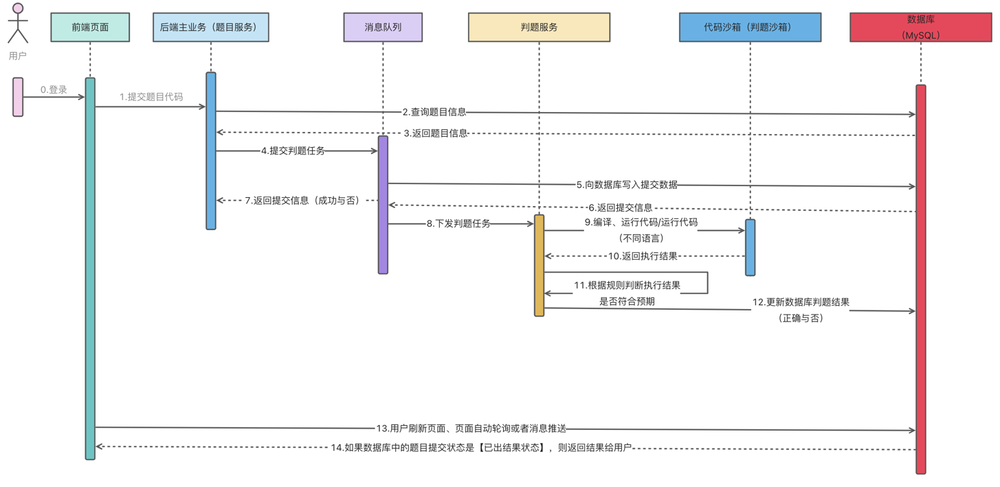

# zhaoj-backend-microservice
## 简介
📜 编程题目在线评测系统，即 Online Judge（简称 OJ）：OJ，在线判题系统。
用户可以选择题目，在线做题，编写代码并且提交代码；系统会对用户提交的代码，根据我们出题人设置的答案，来判断用户的提交结果是否正确。

🕹 本项目提供给想学习 Java，但不想只做商城、后台类项目的同学们参考。️项目原创为@程序员鱼皮：https://github.com/liyupi

同时，本项目会持续更新，不断加入新功能。


📦 代码沙箱代码仓库地址：https://github.com/y138g/codeSandbox ，其中，代码沙箱为单独服务，并不再这套微服务体系中，目的是可以后续供给其他服务使用。如有需要，也可作为单独模块导入到项目中。

## 在线体验

🔗 体验链接：http://www.nozhanan.com

📌 声明：由于本人对前端不熟悉，因此前端做的比较简陋且 bug 偏多，此项目后续会持续更新，所以若有意向合作的小伙伴可以联系我。

📝 WeChat：1259737090

📮 Email：BlueHorizon6005@gmail.com

---
## 技术选型
+ 主语言：Java8
+ 开发框架：SpringBoot + Docker + SpringCloud + MyBatis + MyBatisPlus
+ 数据库：MySQL
+ 中间件：Redis、RabbitMQ、Nacos
+ 对象存储：阿里云 OSS
---
## 系统模块
```
com.itgr     
├── zhaoj-backend-gateway         	    // 网关模块 [8101]
├── zhaoj-backend-common                    // 公共模块
├── zhaoj-backend-model                     // 模型模块
├── zhaoj-backend-service-client            // 公用调用接口模块
├── zhaoj-backend-user-service		    // 用户模块 [8102]
├── zhaoj-backend-question-service	    // 题目模块 [8103]
├── zhaoj-backend-judge-service		    // 判题模块 [8104]
├── pom.xml                                 // 公共依赖
```
---
## 路由划分
用 springboot 的 context-path 统一修改各项目的接口前缀：

用户服务：
+ /api/user 
+ /api/user/inner（内部服务，网关层面做限制）

题目服务： 
+ /api/question（包括题目提交信息） 
+ /api/question/inner（内部服务，网关层面做限制）

判题服务： 
+ /api/judge 
+ /api/judge/inner（内部服务，网关层面做限制）

图表生成服务： 
+ /api/chartgen 
+ /api/chartgen/inner（内部服务，网关层面做限制）
---
## 时序图


---
## 内置功能
1. 用户服务: 提供用户登录、用户的增删改查等管理功能。
2. 题目服务: 提供题目的增删改查管理、题目提交功能。 
3. 判题服务: 提供判题功能，调用代码沙箱并比对判题结果。 
4. 代码沙箱: 提供编译执行代码、返回结果的功能。 
5. 公共模块:提供公共代码，比如数据模型、全局请求响应封装、全局异常处理、工具类等。
6. 网关服务: 提供统一的 API 转发、聚合文档、全局跨域解决等功能。
---
## 使用说明
1. clone 本项目到本地
2. 根据自身需求更改项目名、组名
3. 全局搜索 “todo” 更改每一个 application-test.yml 中的配置，并重命名为 application.yml
4. 若需要上线，请更改 LocalCorsConfig 文件的配置
5. 启动项目需要先启动网关模块（zhaoj-backend-gateway）
6. 访问 Swagger 文档：http://localhost:8101/api/question【你的服务】/doc.html ，进行调试。⚠️修改你的服务，例如 user、question 等。
